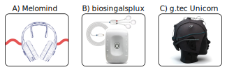
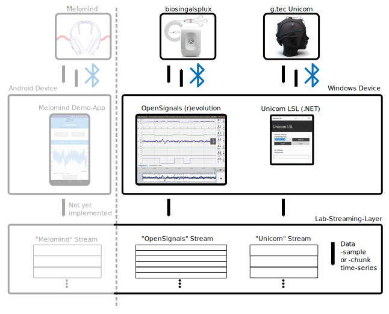
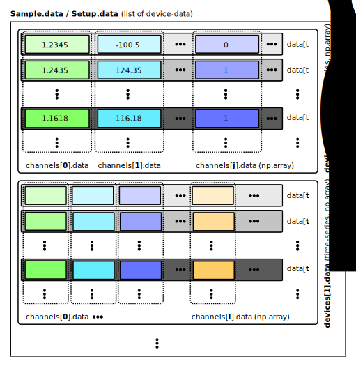
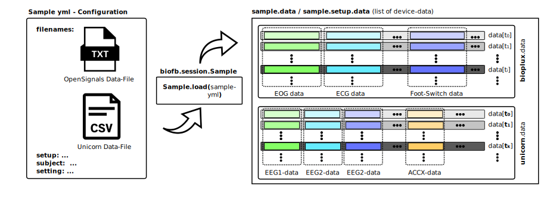
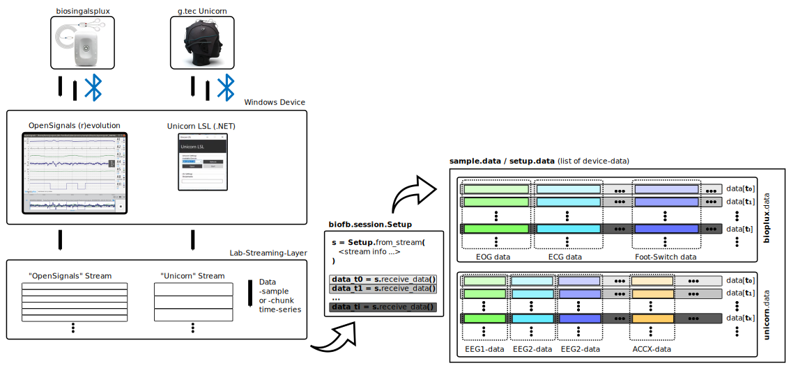
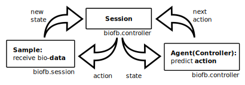

# bio-feedback

## Introduction

The **bio-feedback** framework `biofb` is our core software framework for our shared **Brain Project** (*better names are welcome*).

It allows 

- capturing data with bio-sensory hardware (mostly 
  via the *[Melomind heaset](https://www.melomind.com/en/operation/)*,
  via the *[biosignalsplux hub](https://plux.info/components/263-8-channel-hub-820201701.html)* and *[related sensors](https://biosignalsplux.com/products/sensors.html)* 
or via the *[g.tec Unicorn EEG Device](https://www.unicorn-bi.com/?gclid=Cj0KCQiAyoeCBhCTARIsAOfpKxjuuKF57_Ng2IqhxVD_UgluFzqpDAXGvv8eJGDZtPF1wmyVdLI_YLgaAmf8EALw_wcB)*)
- opening and handling data from data-acquisition sessions of above devices,
- preprocessing, postprocessing and analysing the data, and
- providing/generating feedback signals via agent instances
  
with the goal of guiding/controlling the bio-sensory data of a subject during a session towards a characteristic state with well-defined features.

[*Note: maybe we even need an ethical agreement for our project*].

The Python framework is described in the [Data-Analysis Section](#data-analysis) below.
Also check-out the [Installationand Setup of the `biofb` Python Package](#installation-and-setup-of-the-biofb-python-package) and the [Demos and Examples](#demos-and-examples) Sections.

## Project Structure

### Experiment Design (in Linz: RB, DMo)

*	Select Sensors
*	Define Procedures
*	Definition of App functionalities

### Measurement of Experiments (in Linz: RB, BH, TT, DMo)

*	Protocol on the session including questionnaire
*	Data acquisition and synchronisation using Python framework
*	Build up database

### Data analysis (BH, GC, DMi, DMo, TT)

*	Build Python Framework (BH, TBD)
*	Research state of the art EEG/Bio Signals analysis = preprocessing of raw data (DMi, GC)
*	Find correlations between subjective states and objective sensor values (DMo, GC, TT, BH)

 

### Controller Design (DMo, GC, BH)


### App Design (MP, DA)

*	Implement functionalities to conduct experiments (MP, DA)
*	Generation of sounds (music, sound, voice)
*	Implementation of the feedforward loop (MP, DA)
*	Implementation of the feedback loop (MP, DA)

## Experimental Design (Third-Party Bio-Sensory Hardware and Software)


*Sketch of the three third-party bio-sensory hardware devices we currently use in the project.*

### Melomind
The *[Melomind](https://www.melomind.com/en/operation/)* is a bluetooth head-set device with 2 EEG sensors and 2 related quality signals.
Its goal is to guide participants towards deep relaxation via audio-feedback.

*Note: We (RB, BH, TH) have the impression, that this does not work properly: 
the software-feedback often displays states of relaxation when people are highly focused - so the feedback loop of *Melomind* might be improvable.* 

### biosignalsplux and OpenSignals (r)evolution

*[biosignalsplux](https://biosignalsplux.com/)* is a bio-sensory hardware setup that allows data-acquisition of various bio-signals such as (EEG, ECG, EMG, EOG, EDA, ...) with *[related sensors](https://biosignalsplux.com/products/sensors.html)*. 
We are currently using the *[biosignalsplux 8-channel hub](https://plux.info/components/263-8-channel-hub-820201701.html)*. 

The *biosignalsplux* hardware is  interfaced on a desktop or notebook via bluetooth with the *[OpenSignals (r)evolution](https://biosignalsplux.com/products/software/opensignals.html)* software, a Python-powered web-based application.
The *OpenSignals (r)evolution* software allows to configure the hardware setup of a *biosingalsplux* device, i.e., the channel configuration.

*OpenSignals (r)evolution* is supported on **Windows 10** and on **Android** (in principle, also a **Linux** version exists but here **bluetooth connection issues** prohibit data acquisition).

The *OpenSignals (r)evolution* Documentation can be found [here](./doc/bioplux/OpenSignals_Manual.pdf).

Documentation and example data analysis for the different channels can be found [here](doc/bioplux/sensors) for each sensor or check the [biosignalsplux sensors'-page](https://biosignalsplux.com/products/sensors.html):
choose the required sensor and click on the DOWNLOADS menu to access jupyter-notebooks and sample data.

[comment]: <> (#### Installation &#40;for linux&#41;)

[comment]: <> (1&#41; Download *OpenSignals &#40;r&#41;evolution* either from the [*biosignalsplux*]&#40;https://www.biosignalsplux.com/en/software/&#41; or from the [*BiTalino*]&#40;https://bitalino.com/en/software&#41; websites. )

[comment]: <> (2&#41; Install open the *Terminal* and `cd` to the dictionary where the `OpenSignals_revolution_ubuntu_amd64.deb` file is located.)

[comment]: <> (3&#41; Install the software with the following command and follow the instructions:)

[comment]: <> (```bash)

[comment]: <> (sudo apt install ./OpenSignals_revolution_ubuntu_amd64.deb)

[comment]: <> (```)

[comment]: <> (4&#41; The *OpenSignals &#40;r&#41;evolution* interface should be *available as application* &#40;as `OpenSignals`&#41; or through the *Terminal* &#40;as `opensignals`&#41;.)

### g.tec Unicorn

The *[g.tec Unicorn](https://www.unicorn-bi.com/?gclid=Cj0KCQiAyoeCBhCTARIsAOfpKxjuuKF57_Ng2IqhxVD_UgluFzqpDAXGvv8eJGDZtPF1wmyVdLI_YLgaAmf8EALw_wcB)*
is an 8-channel EEG-cap which is interfaced with a Windows desktop or notebook via bluetooth.

The *g.tec Unicorn* comes with a *[Unicorn Suit](https://www.unicorn-bi.com/de/unicorn-suite/)* software that allows setting up a bluetooth connection with the cap under Windows.
The *g.tec Unicorn Suit* includes a 
- *Unicorn Recorder* plugin which allows 
    (i) to **acquire EEG data**, 
    (ii) to **apply** notch and bandpass **filters** to the signals and which 
    (iii) provides **quality-assessments** of the EEG channels (which is *most likely* based on comparing the *variance of each channel over an extended time-period*; usually only high-end devices provide quality-assessments via impedance values of each electrode), a 
- *c-API* which can be used to generate a custom data-acquisition python module (e.g. via boost-python), and a
- *[Unicorn .NET API](https://github.com/unicorn-bi/Unicorn-Suite-Hybrid-Black/tree/master/Unicorn%20.NET%20API)*. 

The *Unicorn Recorder* application requires a Software License (to be purchased).

The data from the *g.tec Unicorn Suit* can be acquired via the *g.tec* **Python API**, which also requires a software licenses (to be purchased).

*[Note: We therefore should rely on the *c-API* or, more likely, on the *Unicorn .NET API* for data-acquisition purposes. The implementation of the basic filters (notch and bandpass) should not be too difficult in the bio-feedback framework]*

### Putting It All Together:  The Lab-Streaming-Layer
The [**Lab Streaming Layer**](https://github.com/sccn/labstreaminglayer) (LSL) is an overlay network for real-time exchange of time series between applications, 
most often used in research environments. LSL has clients for many languages (such as Python, Java, .NET) 
and platforms (such as Max, Windows or Linux) that are compatible with each other 
*[from the official LSL git repository]*.

All of our currently used devices (*Melomind*, *biosignalsplux*, *g.tec Unicorn*) allow a binding to the LSL, i.e., data from the hardware can be streamed to the LSL and acquired in Python, using the [`pylsl`-package](https://github.com/chkothe/pylsl).
Details on how to setup a multi-device LSL network can be found below (see [How-To Lab-Streaming-Layer](#how-to-lab-streaming-layer)).

**ATTENTION**: *Privacy and security issues might be a problem for the production state. 
LSL streams without encryption on serveral ports without authentication necessities.*

### General Remarks on Interfacing Bio-Sensory Data

To implement a bio-sensory data controlled feedback loop we implement the `biofb` Python package (see the [Introduction](#introduction)).

The communication between the devices (streaming to the LSL) and with our final application (Python) is implemented in the [`biofb/pipeline`](biofb/pipeline) package.

Sensor/Channel-specific signal analysis should be implemented by us to pre-process the bio-signals to meaningful data a machine can more efficiently work with.
The designated Python packages are 
- [`biofb/signal/channels`](biofb/signal/channels) for procedural signal analysis, and
- [`biofb/hardware/channels`](biofb/hardware/channels) for higher-level applications.

### Documentation `/doc`

Documentation about third-party hardware and software-packages (user-manuals and data-sheets) can be found in the `/doc` folder. 

## Measurement of Experiments

### Version 0
Our first measurements were performed by starting each device-specific data-acquisition separately, generating as many data-files as devices used during the measurement:
- We performed *Melomind Demo-App* measurements (see the corresponding melomind example [jupyter-notebooks](examples/notebooks/melomind)).
- We performed *OpenSignals (r)evolution* measurements on the *biosignalsplux* hardware (see the corresponding bioplux example [jupyter-notebooks](examples/notebooks/bioplux)).
- We performed *Unicorn Suite* measurements (see the corresponding unicorn example [jupyter-notebooks](examples/notebooks/unicorn)).
- We perfomred combined *OpenSignals (r)evolution* and *Unicorn Suite* (see the corresponding *bioplux-unicorn* example [jupyter-notebooks](examples/notebooks/bioplux-unicorn)).
  As **synchronization protocol** we use the EEG-channels of the *biosignalsplus* and the *g.tec Unicorn*:
  The data-acquisition of both devices were started with a delay of a few seconds.
  The participants were then asked to **clench their teeth several times** at the beginning of the data-acquisition which leads to visible **high-intensity signals in the EEG-channels** of both devices.
  We can synchronize on these events manually (or algorithmically later on).
  
The *biosignalsplux* hardware comes with a **foot-switch** (attached to channel 8 of the hub) which we used to **mark events** in the data-time series: 
- At the **beginning** of a session, the controller was asked to press the **foot-switch twice**; this marks as a starter signal of the measurement.
- Whenever a **certain event** occurs (e.g., increased level of relaxation), the controller provides a **foot-switch signal**.
- At the **end** of the measurement, the controller presses the foot-switch several times, marking the end of the session.

The data-handling and analysis is performed via our own `biofb`-package (see below), here a sketch of the measurmenet-to-analysis flow:


*Sketch of individual data-acquisition of the *Melomind*, *biosingalsplux* and the *g.tec Unicorn* devices via the *Melomind Demo-App*, the *OpenSignals (r)evolution* and the *g.tec Unicorn Recorder*, respectively. Note: The *Melomind* acquisition is grayed out since we are not sure if we should proceed with this hardware.*

### Version 0.1: synchronized data-acquisition via the `biofb`-package
To increase the synchronizability, scalability and accessablility of the bio-sensory data, we rely on the *Lab-Streaming-Layer*.

We implemented an LSL-data-receiver functionality in the `biofb`-package that allows us to receive data from all devices (with potentially different sampling rates) synchronously (see the [Data-Analysis Section](#data-analysis) below and the [pipeline-examples](examples/pipeline)).

The acquired data can then be further preprocessed and analysed before being 
- either stored to a *xdf*-file (*TODO*, standard binary file-format for LSL applications, alternatively we could use hdf5)
- or directly used by a controller to perform feedback actions. 

Here a sketch of the LSL-data-acquisition using the `biofb`-package:


*Sketch of Lab-Streaming-Layer (LSL) data-acquisition of the *Melomind*, *biosingalsplux* and the *g.tec Unicorn* devices via the *Melomind Demo-App*, the *OpenSignals (r)evolution* and the *g.tec Unicorn Recorder*, respectively. 
Note: The different devices might have different sampling rates. The LSL communication takes care of this (and also adds time-stamps to the data which are streamed into the LSL from the different devices). 
Also Note: The *Melomind* LSL-binding needs to be implemented (Java), the acquisition is grayed out since we are not sure if we should proceed with this hardware.*

### Data: `/data`

The project data (which comprises *session samples*, *audio recordings*, *preprocessed data*, ...) is stored separately to the git-repository via our shared [Dropbox, `hex`](https://www.dropbox.com/sh/sppl4auj650zy4q/AACIACSEJroiu1rLcaBQDJy8a?dl=0).

The [Dropbox data-folder `hex/data`](https://www.dropbox.com/sh/kjbf0912f8dwxkf/AABJebYYiqZFMw3BuI4QFd_ka?dl=0) with all sub-folders should -- as is -- be copy-pasted into the `bio-feedback` git-project's root directory, `/`, i.e. `hex/data/*` -> `/data/*`.

The reason to store the data separately is due to data-security and privacy issues.
The `/data` folder is explicitly excluded from the git-repository via `.gitignore`.

Alternatively, the `data` folder can be shared via a peer-to-peer [Syncthing](https://syncthing.net/) client.

*[Note: Surely, there is room for improvement how to share our data. I'm happy for suggestions (e.g. an automized way how to download the data from the Dropbox or a separate git-repository).]*

## Controller Design
**[To be done]**

## Data Analysis

### The `biofb` Python Framework

The base datatype of the `biofb` package is the `biofb.session.sample` class.

This class brings together
- `biofb.pipeline` data-acquisition of a `biofb.hardware.setup` (which comprises a list of `biofb.hardware.device` instances, each containing again a list of `biofb.hardware.channel` objects for each bio-signal)
- for a `biofb.session.subject` (the participant whose bio-data is captured)
- in a well-defined `biofb.session.setting` (the overall scope of the experiment, e.g. a test-session, an in-person session or a feedback-session)
- and controlled by a `biofb.session.controller` (a human person or a machine).

Here a sketch, how the data-handling of the `Sample`, `Setup`, `Device` and `Channel` classes gears into each other:

*Sketch of the data-handing of the `biofb` `Sample` `Setup`, `Device` and `Channel`classes: 
The `data` property of a `Sample` instance is, equivalent to the `data` property of a `Setup` instance, a list of `Device`-specific `data` arrays; 
a `Sample`-instance can (additionally to a `Setup` instance) load `Setup`-data from files.
The `data` property of a `Device` instance is the time-series data of captured data from the respective bio-sensory hardware, i.e., a `numpy npdarray` of shape `NumberOfSamples x NumberOfChannels`.
Each data-channel of a `Device` instance can be accessed via its `channels` property, a list of `Channel` insances related to the columns in the `data` property of the `Device` instance. 
The respective `Channel` instances can access (in a read only mode) the corresponding `data` columns from their associated `Device` instance.
Data acquired at different time-steps are colored in different gray-scales, data of different channels of a specific (related to different sensors) have differently color, devices can have different sampling rates and different numbers of channels.*

To load acquired `Sample` instances, `biofb.session.Sample.load(<dict-like-sample or path-to-former>)` can be called, which takes care of eventually loading the data from provided data-files, see the following sketch: 


#### The `biofb.io` sub-package

File-handling- and database access operations are collected in the `biofb.io` sub-package.
Each class in the `bio-feedback` inherits from `biofb.io.loadable.Loadable`, which allows instances of the different classes to be loaded from `dict`-like objects (such as Python dictionaries, different representations of such dictionaries, `yaml`-files, `json`-files, etc.).

In `version 0.1`, the bio-data for captured session-samples is managed by a `yml`-based 'database' class, i.e., by `biofb.io.session_database`.

[*Note: this is a simple way to provide data access quickly in an early stage of the project. However, we should make a transition to a rigorous database soon. 
I hope, that this approach can easily be transformed to a database approach.*]

File-format transformations of *wave-audio-files* are collected in the `biofb.io.wave_file` module.

#### The `biofb.session` sub-package

In the `biofb.session` sub-package, the basic data-structure of a `biofb.session.sample` is defined in a modular way which should (hopefully) be easily mappable to a database.

A `biofb.session.sample` contains information about the `participant` whose `data` are/were acquired using a specific `hardware`-`setup` during a session with a specific `controller`.
Other meta-data such as `location` or `date-time` of a session can/should also be added.
Further, we will also need feedback information about the quality of the session by the participants and their personal experiences.

The handling of these different aspects of a bio-feedback sample is realized/united in the `biofb.session.sample` class.

See also the [Measurement of Experiment - Section](#measurement-of-experiments) for a sketch of the experimental bio-data acquisition setup.

#### The `biofb.hardware` sub-package

The general datastructures to handle a hardware setup is given by the `biofb.hardware.Setup` class.
It primarily contains a list of devices.

The general datastructures to handle a specific device is given by the `biofb.hardware.Device` class.
Each device captures data from several channels which is usually stored/provided in a `numpy` array.
For a more convenient data-handling of the different channels, each device contains a list of channel objects.
Each device also is able to perform data-acquisition using `biofb.pipeline.Receiver` configurations, which is synchronized in hardware `Setup`, or in a `Sample` session.

The general datastructures to handle a specific channel from a specific device is given by the `biofb.hardware.Channel` class.
This class has a link to its associated `Device` and can in that way access the channel-specific device data (which is one numpy array).

In the sub-package `biofb.hardware.devices`, more specific `Device`-classes are implemented that are related to more specific devices (e.g., Melomind, Bioplux and Unicorn).
These different device-specific classes allow capturing and handling the device-specific data.

In the sub-package `biofb.hardware.channels`, more specific `Channel`-classes are implemented that are related to more specific bio-sensory channels (e.g., EEG, ECG, EOG, EDA, ...).
These different channel-specific classes allow task-specific and targeted preprocessing (filtering, stabilizing, etc.) and postprocessing operations (transformations, analysis, feature extraction, quality predictions, etc.).

*[Note: channel handling works, i.e. each channel of a device can be related to a specific channel class in `biofb.hardware.channels` via labels and class names.]*

*[Note: channel specific data-handling using filters, etc., is work in progress, documentations and literature can be found on the device-specific websites and also in the related `biofb.signal.channel` sub-package, which contains(will contain) implementations of channel specific functionalities.]*

#### The `biofb.pipeline` sub-package

Here, data `Reiceiver` and `Transmitter` classes are implemented that can be used to receive and send data from different bio-sensory devices (data-acquisition that can be used in Python).

We mainly rely on the open-source [*Lab Streaming Layer*](https://github.com/sccn/labstreaminglayer) and the [pylsl](https://pypi.org/project/pylsl/) package to directly access the data form third party bio-sensory hardware in the `biofb` framework.

Here a sketch how data-acquisition might work from third-party devices to the `biofb` framework

*Data are produced by the *biosingalsplux* and *g.tec Unicorn* devices (top left).
The data can be accessed via the *OpenSignals (r)evolution* and the *Unicorn LSL* client, which broadcast corresponding *OpenSignals* and *Unicorn* (central left) streams to the *Lab-Streaming-Layer* (bottom left).
The `biofb.session.Setup` class allows to load a `biofb` `Setup` directly from a stream (central bottom), if the `Device` types are known (cf. `biofb.hardware.devices` and `biofb.pipeline`).
Such a `Setup` can then receive dta from multiple devices simultaneously and stores the results in its `data` property (right).
Check also the [bio-feedback pipeline examples](examples/pipeline) for practical implementations of data-streaming applications.
Note: the different devices might have different sampling rates.
The color-coding and data-indexing of the code snippet in the center might be slightly misleading.
Data are usually received for a fixed time-interval in chunks that are related to the sampling-rates of the different devices (i.e. 250 data-samples from the Unicorn and 500 data-samples from the biosignalsplux per second).*

#### The `biofb.visialize` sub-package
Here, data visualization tools are implemented.

- The `biofb.visialize.DataMonitor` allows to plot (in a non-blocking way) time-series data. 

#### The `biofb.signal` sub-package

The `biofb.signal` sub-package contains pure procedural (function-) collections of signal specific data operations:

- pre-/ postprocessing of various spatio-temporal bio signals
- pre-/ postprocessing of channel-specific data (ECG, EEG, ...) in the `biofb.signal.channels` sub-package (which are related to the corresponding high-level `biofb.hardware.channels` classes).

#### The `biofb.controller` sub-package

The `biofb.controller` sub-package provides the main feedback loop of the `bio-feedback` software framework:

- The `biofb.controller.Session` comprises a pro-active `biofb.controller.Agent` and a participant, interacting via measured `biofb.session.Sample` bio-sensory data.
- The `Agent` proposes `actions` to be performed on a participant (e.g., it selects audio signals to be replayed).
- This will change the `state` of the participant (i.e., the captured `state` of the bio-signals in a `biofb.session.Sample`).

Here a Sketch:


Once again:

- The actions are proposed by a `biofb.controller.Agent`.
- Data acquisition is performed by the used `biofb.hardware.Setup` *[Note: work in progress]*.
- The feedback of `action(state)` -> `state update` -> `action(updated state)` -> ... is controlled by the `biofb.controller.Session`. The proposed actions and the acquired bio-data (ì.e., `action` and `state`) are recorded by the `biofb.controller.Session` *[Note: work in progress]*.

The model of how to control the `state` of a participant is `Agent`-specific, and we propose three sub-categories of agents at the moment via the sub-packages *[Note: this might change in the future]*

- `biofb.controller.audio`
- `biofb.controller.generative`
- `biofb.controller.verbal`.

Each realisation of an `Agent` has an internal model (or a policy) based on which the agent decides what action to propose given a particular sample-state (or a sample-state history) *[Note: future work]*.

*[Note: this might be updated in the future]*

### Installation and Setup of the `biofb`-Python package

#### Create virtual environment (venv)
First, make sure Anaconda is installed. Then create a new virtual environment (venv):
```bash
conda create --name bio-feedback python=3.7
```
(the *OpenSignals (r)evolution* Python package (`plux`) requires Python 3.7.).

and activate it
```bash
conda activate bio-feedback
```

Also, make sure that the `bio-feedback` venv is added to the `jupyter` kernels:
```bash
python -m ipykernel install --user --name="bio-feedback"
```
(`jupyter` should be installed either in the Anaconda `base` venv or in the `bio-feedback` venv to allow usage of the jupyter demo-notebooks.)


You can leave the venv via 
```bash
conda deactivate
```

#### Install `biofb` package in venv

Use `pip` to install the `biofb` package to your Python environment
```bash
python setup.py install
```

*[Note: this has been tested in Ubuntu 18.04 and in Windows 10 using the Git-Bash.]*

#### Use `biofb` package as `PYTHONPATH` library

Navigate to the project root directory `<PROJECT_ROOT>`

```bash
cd <PROJECT_ROOT>
```

For *Linux* install the following dependencies:
```bash
sudo apt-get install -y python3-dev libasound2-dev
```

Use `pip` to install all requirements
```bash
python -m pip install -r requirements.txt
```

Add the `<PROJECT_ROOT>` directory to the `PYTHONPATH` environment variable 

##### Linux

```bash
export PYTHONPATH=$PYTHONPATH:<PROJECT_ROOT>
cd test
python -m unittest discover -s .
```

##### Windows (not tested)
```bash
set PYTHONPATH=%PYTHONPATH%;<GLOBAL_PROJECT_ROOT>
cd test
python -m unittest discover -s .
```

#### Additional Dependencies and Sources

Under *Linux* the Python-package `simpleaudio` requires the following library to be installed:

```sudo apt-get install libasound2-dev```


#### Test Installation

Run unittests from `<PROJECT_ROOT>/test` directory:
```bash
cd <PROJECT_ROOT>/test
python -m unittest discover -s .
```

### Demos and Examples

Demos, tutorials and examples how to use the code framework should be provided in the `test/biofb_unittest/` and `examples` packages.

#### Examples in `examples`

Several simple examples are implemented here, see the respective [README](examples/REAMDE.md) for details.

#### Jupyter-Demo Notebooks in `/examples/notebooks`
There is some demo-notebooks used to demonstrate data-handling/analysis/visualization in `/examples/notebooks` for the *Melomind*, *g.tec Unicorn* and the *Bioplux* bio-sensory hardware.

Please do not commit changes made simple due to execution of the notebooks.
You can copy (duplicate) a notebook to `<nb-name>.local.ipynb`, the duplicated notebook with `.local` is excluded from git via `/.gitignore`. In that way you can quickly experiment around. 

#### Unittests in `test/biofb_unittest/<same structure as biofb-packages>`
The module-structure of `biofb_unittest` is equivalent to the module structure of `biofb`.
Class/Task specific tests of the `biofb` module can thus be found in the `biofb_unittest` package.

The unittests **can** be run from within the `<PROJECT_ROOT>` folder via:
```bash
python -m unittest discover -s test
```

but **should** be run from within the `<PROJECT_ROOT>/test` folder.
This requires to either 
- add the `<PROJECT_ROOT>` to the `PYTHONPATH` environment variable (see **Setup** above)
- or to install the `biofb` Python package via the `setup.py` script (see **Setup** above). 

The reason for this is relative path-relations to the `test/data` folder.
(Some fallbacks to an execution directly from `<PROJECT_ROIOT>` are implemented.)

### How To: *Lab Streaming Layer*

#### LSL LAB-Recorder

Via the [LSL LAB Recorder](https://github.com/labstreaminglayer/App-LabRecorder) -- a stand-alone Application -- 
data from different devices (which are streaming to the LSL) can be acquired synchronously (see the [release List](https://github.com/labstreaminglayer/App-LabRecorder/releases) for downloading and installation; a Windows10 preinstalled [Lab_Recorder.exe](biofb/pipeline/LSL-Lab_Recorder/LabRecorder.exe) is located in [`biofb/pipeline/LSL-Lab_Recorder`](biofb/pipeline/LSL-Lab_Recorder)).

The LSL Recorder stores data in a binary *xdf*-format, which can be accessed in Python via `pyxdf` 
(here the [official github repo](https://github.com/xdf-modules/pyxdf)).

#### The `pylsl`-Package

`pylsl` is a [Python interface](https://pypi.org/project/pylsl/) to the Lab Streaming Layer (LSL) 
which can be installed via 
```bash
pip install pylsl
``` 
*(supported for Python 3.7 or 3.8 and Wind32/64, Linux64 and macOS 10.6+ in `pylsl-1.14.0`)*.

The package can also be built manually following the [installation guide](https://github.com/labstreaminglayer/liblsl-Python/).

Examples of `pylsl` usage can be found on the official [github repo](https://github.com/labstreaminglayer) 
in the [`pylsl/examples` subfolder](https://github.com/labstreaminglayer/liblsl-Python/tree/master/pylsl/examples). 

#### Melomind
Melomind provides a [Android demo-app](https://github.com/mbt-administrator/DemoSDK.Android) which is open-source.
We implemented a version that can be installed on an Android phone which stores EEG data in a file on the phone.

We [modified this demo-app](https://github.com/bhartl/Melomind-DemoSDK-Android) such that data are stored to a file on the Android device running the demo-app (not included in the bio-feedback package -- we are not sure if we will proceed with this hardware).

Ideally, we manage to stream the data from the Melomind *Demo App* to the 
[**Lab Streaming Layer**](https://github.com/sccn/labstreaminglayer) and 
capture the data in Python using the `pylsl` library (see below).

#### *biosignalsplux* and *OpenSignals (r)evolution*

The *OpenSignals (r)evolution* studio allows to stream the data on the *Lab Streaming Layer* such that data can synchronously be acquired using the `pylsl` library (see the [OpenSignals LSL Manual](doc/bioplux/OpenSignals%20LSL%20Manual.pdf)).

To configure the *OpenSignals (r)evolution* data-streaming to the LSL we follow the [manual](doc/bioplux/OpenSignals%20LSL%20Manual.pdf):
- Click on the *OpenSignals (r)evolution* **Settings** button.
- Click on the **INTEGRATION** tab.
- Check the **Lab Streaming Layer** option.
- Start *OpenSignals (r)evolution* data acquisition by clicking on the **Record Button**.
- The bio-signals are streamed to the LSL and can, for instance, be acquired with the 
  *Lab Recorder* or via the `pylsl` library directly in Python.

#### The *g.tec Unicorn .NET API*

To stream the *g.tec Unicorn* data to the [Lab Streaming Layer](https://github.com/sccn/labstreaminglayer),
the **UnicornLSL client**  needs to be installed.
A pre-built of the **UnicornLSL client** can be found in the [`biofb/pipeline/LSL-Unicorn` folder](biofb/pipeline/LSL-Unicorn); it is supported under Windows 10 ([Win64/UnicornLSL.exe](biofb/pipeline/LSL-Unicorn/Win64/UnicornLSL.exe)), a Linux version is not (yet?) available.

The **UnicornLSL client** is a GUI-application which can be connected to the *g.tec Unicorn Black Suit* 
(by selecting the corresponding device an clicking on `Open`) and which can `Start`/`Stop` a stream
to the LSL. 
Once a connection to the *Unicorn* is open, a corresponding stream should then be visible in the LSL.
This can be checked using the [Lab Recorder](https://github.com/labstreaminglayer/App-LabRecorder).

If something does not work, the **UnicornLSL client** can be **manually installed**.
To manually install the **UnicornLSL client** closely follow the setup-instructions for the 
[Unicorn .NET API](https://github.com/unicorn-bi/Unicorn-Suite-Hybrid-Black/tree/master/Unicorn%20.NET%20API).
Also see the [youtube-tutorial](https://www.youtube.com/watch?v=l18lJ7MGU38) on how to stream data from the 
*g.tec Unicorn* device to the [Lab Streaming Layer](https://github.com/sccn/labstreaminglayer). 

**Prerequisites**:

-    Microsoft Windows 10 Pro, 64-bit, English
-    Unicorn Suite Hybrid Black 1.18.00
-    Microsoft Visual Studio -- Microsoft .NET framework 4.7.1 
     (see the [.NET releases](https://dotnet.microsoft.com/download/visual-studio-sdks?utm_source=getdotnetsdk&utm_medium=referral) 
     site)

1. Ensure that the Unicorn Suite Hybrid Black is installed on your computer.
2. Unzip  `biofb/hardware/pipeline/LSL-Unicorn/UnicornLSL.zip`
3. *(Covered by step 2.:)* Go to the *g.tec Unicorn* [git-repo](https://github.com/unicorn-bi/Unicorn-Suite-Hybrid-Black).
4. *(Covered by step 2.:)* Download the entire git-repo as zip-file and extract it,
5. Copy the files in the `Unicorn .NET API/Unicorn LSL` folder 
   to `C:\Users\<USERNAME>\Documents\gtec\Unicorn Suite\Hybrid Black\Unicorn DotNet\Examples\UnicornLSL`
6. Open the solution `UnicornLSL.sln` in Visual Studio
7. Select the desired configuration (Release/Debug) and build the project

**ATTENTION**: If the build fails the prerequisites have not been installed properly, 
or the project has not been copied to the appropriate path (post build scripts will fail). 
Check the paths to the referenced Unicorn Suite libraries in the project file settings, 
as well as in the post build action.

#### Visualization and Data Analysis

- [MNE tools](https://mne.tools/stable/index.html) is an open-source Python package for exploring, visualizing, and analyzing human neurophysiological data: MEG, EEG, sEEG, ECoG, NIRS, and more.
- [MNE-Lab](https://github.com/cbrnr/mnelab) MNELAB is a graphical user interface (GUI) for MNE, a Python package for EEG/MEG analysis.
- [SigViewer](https://github.com/cbrnr/sigviewer)  is a viewing application for biosignals such as EEG or MEG time series. In addition to viewing raw data, SigViewer can also create, edit, and display event information (such as annotations or artifact selections).


