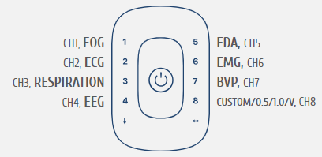
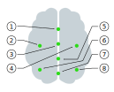

# Bio-feedback Recorder

The [`recorder.py` application](recorder.py) allows to perform a [`biofb.controller.Session`](../../biofb/controller/session.py).
Such sessions might be 
- basic therapist session, capturing the bio-data from a participant
- or a key-stroke controlled feedback session (allowing a controller to replay recorded therapist phrases) while monitoring the bio-data

Either way, both the participants bio-data and the controller interactions (if specified) 

The data are then output to a single compressed *hdf5*-file, which also contains all specified meta-data of the measurement.
The files are stored per default in [data/session/biofb](../../data/session/biofb) (see also [test/data/session/biofb](../../test/data/session/biofb).
The stored files can be loaded using the [`biofb.controller.Session`](../../biofb/controller/session.py) class, simply via `Session.load(<PATH_TO_HDF5>)` (open the [recorder_analysis jupyter-notebook](recorder_analysis.ipynb) in the browser for details).

## Installation
For installation instructions see the [project's README file](../README.md). 

## Recorder Usage
Open a **terminal** and navigate to the `bio-feedback` root directory (I prefer the *Anaconda-Promt*):
```bash
cd <PROJECT ROOT DIRECTORY>
```

If not done already, activate the *Python* environment with the *bio-feedback* installation (here assumed to be named `bio-feedback`):
```bash
conda activate bio-feedback
```

Start the `bio-feedback` recorder with
```bash
python examples/session/recorder.py [-m] [-q]
```

where the optional flags (i) `-m` and (ii) `-q` allow to (i) view the captured data via a life-data monitor and (ii) to reduce the consoe-output of the measurement (quiet-mode).

Via `python examples/session/recorder.py -h` a help-page is shown.

You can always **stop** the measurement by pressing `Ctrl-C` or `ESC` (please press `ESC` before closing the monitor).

The session recorder allows **choosing** from pre-set (or generating new) 
- *Settings* (a setting describes the environmental setup of a session. It specifies the *Controller*, the *Location* and potentially more important details)
- *Subjects* (the experiment participant whose bio-data are captured)
- *Streams* (the Lab Streaming Layer stream names, usually `Bioplux`)

The paths (filesystem locations) where to look for pre-set configurations can be specified when calling the recorder.

After the measurement a compressed **hdf5 output-file** (per default in the [`data/session/biofb` folder](../../data/session/biofb)) is generated, which comprises the entire measurement (measurement setting, subject, hardware setup, bio-data, controller actions).

## Experiment Protocol


### Third-Party Data Acquisition
1) Start *OpenSignals (r)evolution*
   - connect (and configure) the *biosignalsplux* hardware.
   - The routing of our first/default biosignalsplux measurements described [below](#sensor-placement-of-the-biosignalsplux-hardware) looks as follows:
     
     
     
     *Default routing of the biosignalsplux hub*
     
2) Start the *g.tech* Unicorn Suit
   - connect the electrodes of the *Unicorn* EEG device to the *Unicorn* cap
   - connect the *Unicorn* hardware
   - start the recorder (License required)
   - setup the EEG-cap (all signals must be green)

     
   
     *EEG Sensor placement (green symbols indicate good [probably low variance] signals)*


3) Start bothe the *OpenSignals (r)evolution* and *g.tech* Suit data acquisition by clicking on the **Record Button** in each application window.

Each software will produce its own **output** file which can be loaded into our Framework.
(This step needs to be done by hand at the moment, but can easily be implemented in the [recorder.py](.py) application.)

To **synchronize** the signals from both devices, some events need to be present in both data files.
A simple way to this is to ask the participant to **perform several teeth-clenchings** at the beginning of the measurement.
(Dataacquisition with the third-party software is *probably* very robust.
However, this protocol is not fully professional, 
better use the [full integrated measurement](#full-integrated-biofb-session-biofb-all-through) below.
Potentially occuring errors should be documented to improve the framework.)

### Lab Streaming Layer (LSL) Joined Measurement

Performing measurements with the LSL allows to synchronize multi-device data directly during data acquisition.

#### OpenSignals (r)evolution
1) Start *OpenSignals (r)evolution*, connect (and configure) the *biosignalsplux* hardware.
2) Make sure, to enable the *Lab Streaming Layer* access of *OpenSignals (r)evolution*: 
   - Click on the *OpenSignals (r)evolution* **Settings** button.
   - Click on the **INTEGRATION tab**.
   - **Check** the **Lab Streaming Layer** option. 
   - Start *OpenSignals (r)evolution* data acquisition by clicking on the **Record Button**.

#### g.tech Unicorn
1) To stream the *g.tec Unicorn* data to the [Lab Streaming Layer](https://github.com/sccn/labstreaminglayer),
the **UnicornLSL client** needs to be installed.
A Windows 10 built of the **UnicornLSL client** can be found in the [`biofb/pipeline/LSL-Unicorn` folder](../../biofb/pipeline/LSL-Unicorn); it is supported under Windows 10 ([Win64/UnicornLSL.exe](../../biofb/pipeline/LSL-Unicorn/Win64/UnicornLSL.exe)), a Linux version is not (yet?) available.

2) The **UnicornLSL client** is a GUI-application which can be connected to the *g.tec Unicorn Black Suit* 
(by selecting the corresponding device an clicking on `Open`) and which can `Start`/`Stop` a stream
to the LSL. 
Once a *Unicorn* stream is started, a corresponding stream should then be visible in the LSL.

If something does not work, the **UnicornLSL client** can be **manually installed**.
To manually install the **UnicornLSL client** closely follow the setup-instructions for the 
[Unicorn .NET API](https://github.com/unicorn-bi/Unicorn-Suite-Hybrid-Black/tree/master/Unicorn%20.NET%20API).
Also see the [youtube-tutorial](https://www.youtube.com/watch?v=l18lJ7MGU38) on how to stream data from the 
*g.tec Unicorn* device to the [Lab Streaming Layer](https://github.com/sccn/labstreaminglayer). 

See also the **How To: Lab Streaming Layer** Section in the [project's README file](../README.md).

#### Full Integrated `biofb`-Session (`biofb` all through)

The `biofb` recorder should also be capable of receiving the data from the Lab Streaming Layer (see [above](#recorder-usage))!

#### Third Party Recording

The bio-signals of both devices should be streamed to the LSL and can, for instance, be acquired with the [LSL LAB Recorder](https://github.com/labstreaminglayer/App-LabRecorder) or via the [pylsl library](https://github.com/chkothe/pylsl) directly in Python, see the [lsl_acquisition.py](../../examples/pipeline/lsl_acquisition.py) pipeline example file.

Via the LSL LAB Recorder -- a stand-alone Application -- data from different devices (which are streaming to the LSL) can be acquired synchronously (see the [release List](https://github.com/labstreaminglayer/App-LabRecorder/releases) for downloading and installation; a Windows10 preinstalled [Lab_Recorder.exe](../../biofb/pipeline/LSL-Lab_Recorder/LabRecorder.exe) is located in [`biofb/pipeline/LSL-Lab_Recorder`](../../biofb/pipeline/LSL-Lab_Recorder)).


## Measurement Protocol

### Sensor-Placement of the *biosignalsplux* hardware

As default setup we use the default channels configuration provided in the [`biofb.hardware.devices.Bioplux` class](../../biofb/hardware/devices/bioplux.py) (cf. Figure [below](#third-party-data-acquisition)):
1) Channel 1 (*CH1*): **EOG**-Sensor (Electrooculography) 
   in **horizontal** configuration (black right, red left, white behind ear on *M1*-position),
   see [User-Manual](../../doc/bioplux/sensors/Electrooculography_(EOG)_User_Manual.pdf)
   and [Datasheet](../../doc/bioplux/sensors/Electrooculography_(EOG)_Datasheet.pdf).
      
   

2) Channel 2 (*CH2*): **ECG**-Sensor (Electrocardiogram) 
   in **lean 1 configuration** configuration (ref top, red in, black out; switching of red and black only changes sign), 
   see [User-Manual](../../doc/bioplux/sensors/Electrocardiography_(ECG)_User_Manual.pdf)
   and [Datasheet](../../doc/bioplux/sensors/Electrocardiography_(ECG)_Datasheet.pdf).

   

3) Channel 3 (*CH3*): **PZT**-Sensor (Piezo-Electric Respiration); vertically placed between *ECG* reference and red/black electrodes,
   see [User-Manual](../../doc/bioplux/sensors/Respiration_(PZT)_User_Manual.pdf)
   and [Datasheet](../../doc/bioplux/sensors/Respiration_(PZT)_Datasheet.pdf).

   

4) Channel 4 (*CH4*): **EEG**-Sensor (Electroencephalogram), fixed with black strap-band. 
   Electrode placement at *FP1* (red, above left eye), *FP2* (black, above right eye) and *M1*-positions (behind left ear above EOG ref),
   see [User-Manual](../../doc/bioplux/sensors/Electroencephalography_(EEG)_User_Manual.pdf)
   and [Datasheet](../../doc/bioplux/sensors/Electroencephalography_(EEG)_Datasheet.pdf).

   

5) Channel 5 (*CH5*): **EDA**-Sensor (Electrodermal Activity) 
   with electrode-placement at fingers of right arm 
   (red: inner side at the bottom third limb of the index finger, 
   black: inner side at the bottom third limb of the middle finger),
   see [Datasheet](../../doc/bioplux/sensors/Electrodermal_Activity_(EDA)_Datasheet.pdf).

   

6) Channel 6 (*CH6*): **EMG**-Sensor (Electrocardiogram)
   with electrode-placement at the right-sided neck a few fingers apart (ref-electrode [item 9 below] placed on clavicula),
   see [Datasheet](../../doc/bioplux/sensors/Electromyography_(EMG)_Datasheet.pdf).
   **Reference** (*Ground*): White sensor, connected with bottom left plug (down pointing arrow).

   

7) Channel 7 (*CH7*): **BVP**-Sensor (Blood Pressure Volume) placed on the left index finger,
   see [Datasheet](../../doc/bioplux/sensors/Blood_Volume_Pulse_(BVP)_Datasheet.pdf).

   

8) Channel 8 (*CH8*): **FSW**-Sensor (Footswitch) in RAW-input mode (could also be used as digital input, 
   but this usually controls parts of the data-acquisition and we want to use it to label events during the measurement). 

   

### Sensor-Placement of the *g.tech* Unicorn
See the [youtube tutorial](https://www.youtube.com/watch?v=UVVUJTwvGnw).

### Foot-Switch Protocol

- start of the measurement: Two successive foot-switch signals (after the recording started)
- deepening states of relaxation:  One foot-switch during the measurement
- end of the measurement: Two or several foot-switch signals (before the recording stops)
